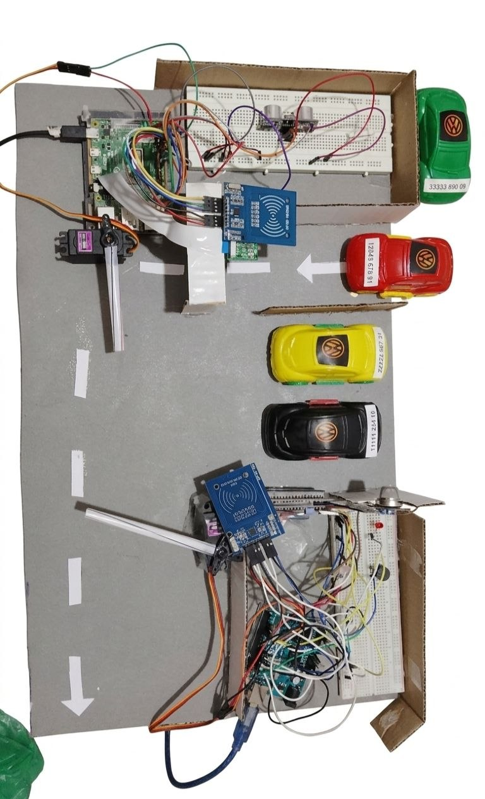
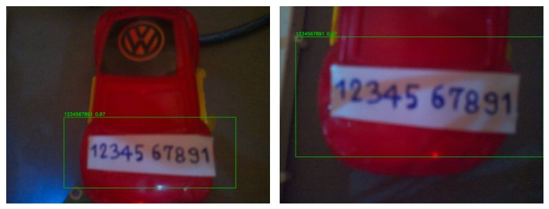
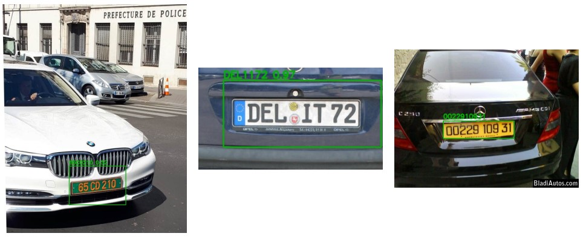
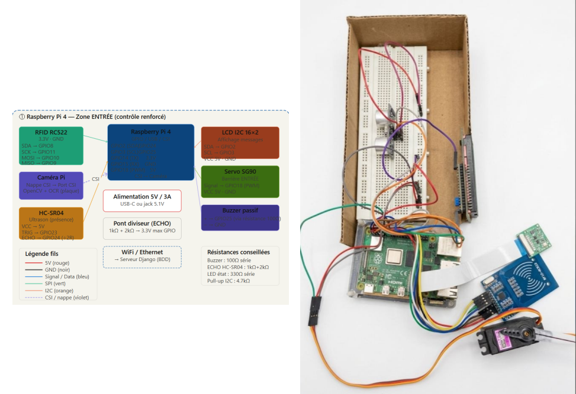
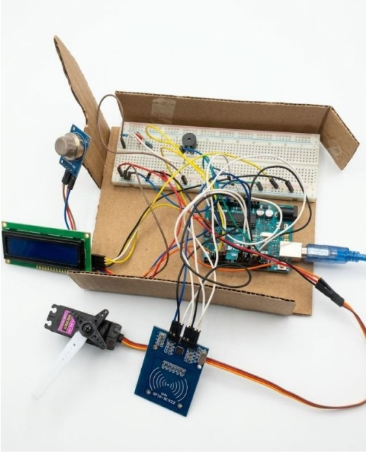
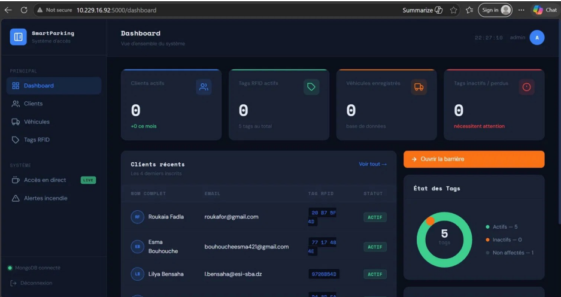
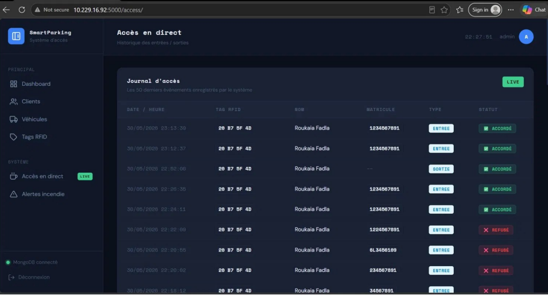
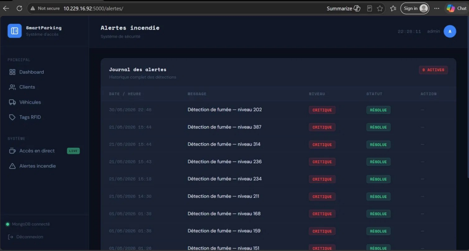
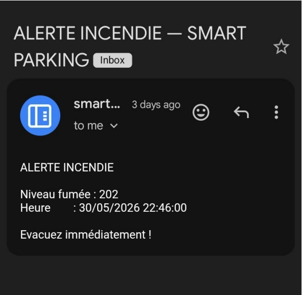

# 🅿️ Smart Parking System

An intelligent, RFID + AI-powered access control system for parking lots — built as a 3CS end-of-year project at **ESI-SBA**.

The system replaces manual/unsecured parking access with a **double-verification entry** (RFID badge + automatic license plate recognition), **automated RFID exit control**, and **real-time fire/smoke detection** with automatic email alerts.



---

## ✨ Key Features

- 🔐 **Double-verification entry** — RFID badge + license plate OCR must both match before the barrier opens
- 🚗 **Automated exit** — RFID-only validation via Arduino, with a fail-safe barrier (stays closed if the server is unreachable)
- 🔥 **Fire/smoke detection** — MQ-2 sensor triggers an emergency barrier opening + automatic email alert to every active client
- 🖥️ **Admin dashboard** — full CRUD for clients, vehicles, and RFID tags, live access log with auto-refresh, fire alert history
- 🌐 **Distributed architecture** — Raspberry Pi (entry) + Arduino (exit) + Flask/MongoDB server, communicating over WiFi (HTTP REST) and USB Serial

---

## 🧠 How the AI pipeline works




License plate recognition uses a **two-stage cascaded pipeline**, chosen specifically because separating detection from text-reading is more accurate than running OCR on the full image directly:

1. **YOLOv12** (ONNX, confidence threshold 0.5) locates and crops the plate region
2. **EasyOCR** reads the text from the cropped region (multilingual, CPU-only — no GPU needed)
3. A custom **scoring heuristic** handles multi-line European plates, and **IoU-based deduplication** filters overlapping detections
4. A **Singleton pattern** keeps the model loaded in memory after the first request (cold start: 40–60s, warm requests: 3–8s)
5. The normalized plate is validated against MongoDB before access is granted

---

## 🏗️ Architecture





## 🛠️ Tech Stack

**Hardware:** Raspberry Pi 4 · Arduino Uno · RFID RC522 · Pi Camera v2 · HC-SR04 · Servo SG90/MG996R · LCD 16x2 I2C · MQ-2 gas sensor

**Software:** Python · Flask · MongoDB + PyMongo · Flask-Login · YOLOv12 (ONNX) · EasyOCR · OpenCV · Arduino C++ · SMTP (Gmail)

---

## 📁 Repo Structure
```
smart-parking/
├── backend/          # Flask app — routes, models, OCR engine
│   ├── app/
│   └── ocr/           # PlateReader (YOLOv12 + EasyOCR + model.onnx)
├── iot/
│   ├── arduino/       # Exit system firmware (C++)
│   └── raspberry/     # Entry system (Python, GPIO, camera, RFID)
└── database/          # MongoDB collection reference
```

## 🚀 Setup

**Backend (PC server):**
```bash
cd backend
pip install -r requirements.txt
cp .env.example .env      # fill in MONGO_URI, SECRET_KEY, ADMIN_PASSWORD
python run.py
```

**Raspberry Pi (entry system):**
```bash
cd iot/raspberry/entry_remote
pip install -r requirements-rpi.txt
python rpi_entry_system.py
```

**Arduino (exit system):** flash `iot/arduino/system_sortie.cpp` via Arduino IDE, then run the serial bridge on the PC:
```bash
python iot/serial_handler.py
```

---

## 📊 Results





| Metric | Value |
|---|---|
| YOLOv12 detection confidence | ~99% (well-lit, frontal plate) |
| OCR read accuracy | High under normal lighting |
| Cold start latency (first request) | 40–60s |
| Warm request latency | 3–8s |

Full RFID and OCR test scenarios (valid client, inactive client, unknown badge, oblique/reflective plates) passed as expected — see the project report for the full test matrix.

---


## 🔭 Roadmap

- [ ] API authentication (keys) + HTTPS/TLS + bcrypt password hashing
- [ ] Retrain YOLOv12 on Algerian/Maghreb plate formats
- [ ] Replace Arduino + serial bridge with ESP32 (WiFi-native)
- [ ] Mobile app for clients to view their own access history
- [ ] Dockerized cloud deployment for multi-camera, higher-traffic parking lots

---

## 👥 Team

Built as a 3CS project at **ESI-SBA**, supervised by **Mr. Abdellatif Rahmoun**.

Team: Fadla Roukaia · Esma Bouhouche · Amro Dennai · Lilya Bensaha

---

